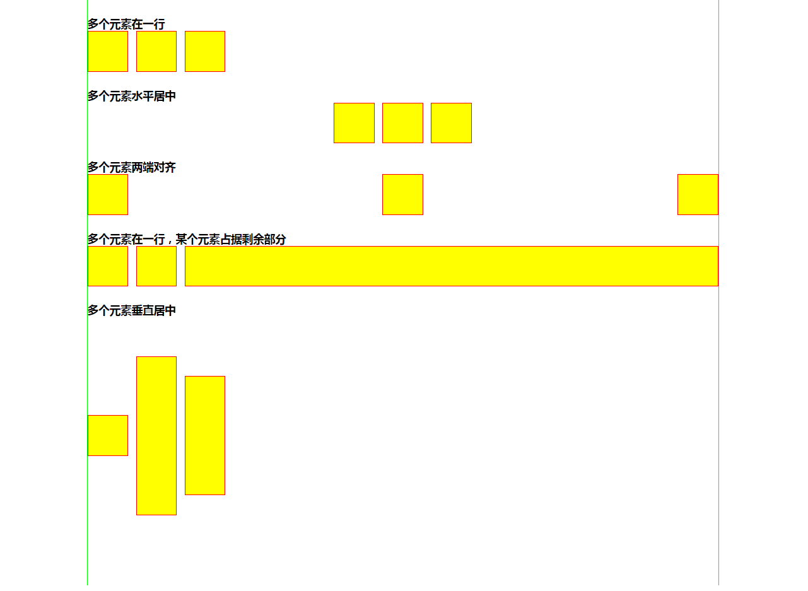

# 2017/3/13~2017/3/19 作业
1. 在我给作业提的建议的基础上，修改自己的作业。
1. 分别用 Flex 和 inline-block 的布局法， 在[这个文件](template.html)（<-点击）上加上样式表，实现下图的效果。

作业代码提交 GitHub。

## 学习资源
* [学习 CSS 布局](http://zh.learnlayout.com/)
* Flex 布局
  * [Flex 布局教程：语法篇](http://www.ruanyifeng.com/blog/2015/07/flex-grammar.html) 阮一峰
  * [Flex 布局教程：实例篇](http://www.ruanyifeng.com/blog/2015/07/flex-examples.html) 阮一峰
  * [Flex 布局 写法示例](http://www.jianshu.com/p/32cc837bd47e)
* inline-block
  * [应不应该使用inline-block代替float](https://www.w3cplus.com/css/inline-blocks.html)
  * [如何解决inline-block元素的空白间距](https://www.w3cplus.com/css/fighting-the-space-between-inline-block-elements)
  * [inline-block 布局写法示例](http://www.jianshu.com/p/eaa1578eddb2)
  * [Kite](http://hiloki.github.io/kitecss/) 是一个基于 inline-block 的框架。读那源码可以学习到很多用inline-block布局时，为兼容某些浏览器需要写的兼容代码。